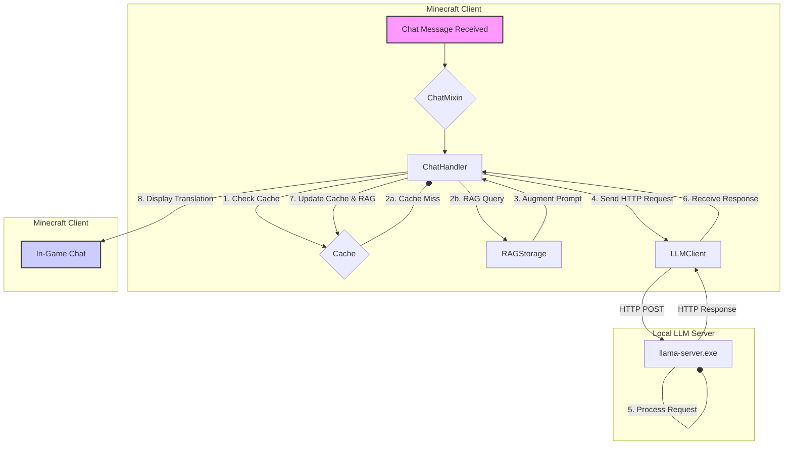

# Chat LLM Translation - AI-Powered Project Analysis

## 1. Abstract

This project is a **Fabric Mod for Minecraft** that provides real-time, in-game chat translation. It leverages a locally hosted Large Language Model (LLM) via the `llama.cpp` engine. The primary goal is to offer a private and efficient translation solution that runs entirely on the user's machine, eliminating reliance on external cloud services.

**Core Features:**
- **Real-time Chat Interception:** Captures incoming Minecraft chat messages.
- **Local LLM Integration:** Communicates with a local `llama.cpp` server for translation.
- **In-Game Display:** Shows translated messages directly in the chat HUD.
- **Translation Cache:** Caches previous translations to reduce redundant API calls.
- **RAG System:** Implements a Retrieval-Augmented Generation mechanism (`rag/RAGStorage.java`) to improve translation accuracy over time by learning from past translations.
- **Configurability:** Provides an in-game configuration screen using ModMenu.

---

## 2. System Architecture

The system operates on a client-server model, all running locally.



1.  **Client (Minecraft Mod):**
    - Written in Java using the Fabric toolchain.
    - A `mixin` (`ChatMixin.java`) intercepts chat messages.
    - `ChatHandler.java` orchestrates the translation process.
    - `LLMClient.java` sends the chat message to the local server via an HTTP POST request.
    - The translated text is then rendered in the game.

2.  **Server (LLM Backend):**
    - A standard `llama.cpp` server instance (`llama-server.exe`).
    - It exposes an OpenAI-compatible REST API endpoint.
    - The server loads a GGUF-format model (e.g., Gemma 3 4B) and performs the translation task.
    - It runs as a separate process, managed by the `start-llama-server.bat` script.

---

## 3. Technical Stack

| Category          | Technology / Library                               | Purpose                                       |
| ----------------- | -------------------------------------------------- | --------------------------------------------- |
| **Language**      | Java 21                                            | Core mod development                          |
| **Minecraft Modding** | Fabric Loader (`0.17.3`)                           | Mod loader                                    |
|                   | Fabric API (`0.136.0+1.21.10`)                     | Modding APIs for Minecraft `1.21.10`          |
| **Build System**  | Gradle (with Fabric Loom plugin)                   | Dependency management and build automation    |
| **LLM Backend**   | `llama.cpp`                                        | High-performance LLM inference engine         |
| **HTTP Client**   | Java 21 `java.net.http.HttpClient`                 | Communication with the LLM server             |
| **JSON Processing** | Gson (bundled with Minecraft)                      | Parsing API responses from the LLM server     |
| **UI / Config**   | ModMenu                                            | In-game configuration menu integration        |

---

## 4. Directory Structure

```
.
├── build.gradle                # Gradle build script for dependency management and tasks
├── gradle.properties           # Project versions (Minecraft, Fabric, etc.)
├── start-llama-server.bat      # Batch script to easily start the local LLM server
├── llama-server.exe            # The core llama.cpp server executable
├── models/
│   └── gemma-3-4b-it-Q4_K_M.gguf # Example LLM model file (GGUF format)
├── run/
│   ├── config/
│   │   ├── chat_llm_translation.json     # Main mod configuration
│   │   └── chat_llm_translation_rag.json # RAG system data
│   └── logs/                     # Minecraft client logs
└── src/
    └── main/
        ├── java/jp/chat_llm_translation/
        │   ├── client/             # Client-side entrypoint and event handling
        │   ├── chat/               # Core chat processing and translation logic
        │   ├── llm/                # LLM server communication
        │   ├── config/             # Mod configuration and ModMenu screen
        │   ├── rag/                # Retrieval-Augmented Generation implementation
        │   └── mixin/              # Mixins to hook into Minecraft's code
        └── resources/
            └── fabric.mod.json     # Fabric mod metadata file
```

---

## 5. Setup and Execution

### 5.1. Prerequisites

- **Java Development Kit (JDK) 21** or newer.
- A compatible GGUF-format LLM model.

### 5.2. LLM Server Setup

The `start-llama-server.bat` script automates this process.

1.  **Place Model:** Put your `.gguf` model file inside the `models/` directory.
2.  **Execute Script:** Run `start-llama-server.bat`.
3.  **Select Model:** The script will detect all `.gguf` files and prompt you to choose one.
4.  **Server Ready:** The script launches `llama-server.exe` with pre-configured parameters (port, context size, etc.). The API will be available at `http://localhost:8080`.

### 5.3. Mod Development & Build

Standard Gradle commands are used.

-   **Run in Development Environment:**
    ```bash
    ./gradlew runClient
    ```
    This will launch the Minecraft client with the mod loaded for testing.

-   **Build Distributable JAR:**
    ```bash
    ./gradlew build
    ```
    The compiled JAR file will be located in `build/libs/`. This file can be installed in a standard Fabric client by placing it in the `mods/` folder.

---

## 6. Core Java Components

The source code is logically organized into packages under `jp.chat_llm_translation`.

-   `Chat_llm_translation.java`: The main mod initializer.
-   `client/Chat_llm_translationClient.java`: The client-side entry point. It registers the chat event listener.
-   `chat/ChatHandler.java`: The central class that orchestrates the entire translation workflow, including caching, RAG, and calling the LLM.
-   `chat/ChatHistory.java`: Manages a history of recent messages, likely for context.
-   `llm/LLMClient.java`: Handles the low-level HTTP communication with the `llama-server`. It builds the JSON request and parses the response.
-   `config/ModConfig.java`: Defines and loads the mod's configuration using a simple JSON file.
-   `config/ConfigScreen.java`: Builds the in-game configuration screen accessible via ModMenu.
-   `rag/RAGStorage.java`: Implements the RAG system. It likely saves and retrieves successful translation pairs to improve future results.
-   `mixin/ChatMixin.java`: Uses Fabric Mixin to inject code into Minecraft's `ClientPlayerEntity` or a similar class to intercept incoming chat messages before they are displayed.

---

## 7. Key Build & Configuration Files

-   **`build.gradle`:** Defines all project dependencies (Fabric API, ModMenu) and configures the Fabric Loom plugin. It uses properties from `gradle.properties` to manage versions.
-   **`gradle.properties`:** A property file that centralizes version numbers for Minecraft, Fabric, Yarn mappings, and other dependencies. This is a best practice for easy version management.
-   **`start-llama-server.bat`:** A crucial utility script that simplifies the process of running the `llama.cpp` server with appropriate settings, including model selection and GPU configuration.
-   **`fabric.mod.json`:** The metadata file required by Fabric. It contains the mod ID, version, entry points, and dependencies. The version number is dynamically inserted during the build process.
